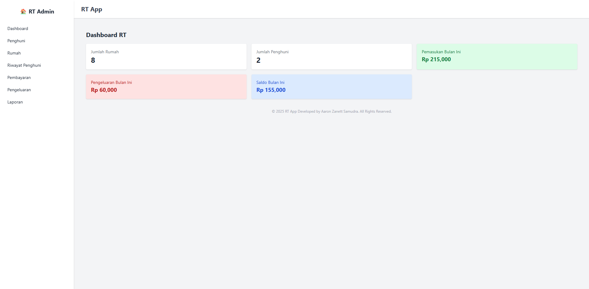
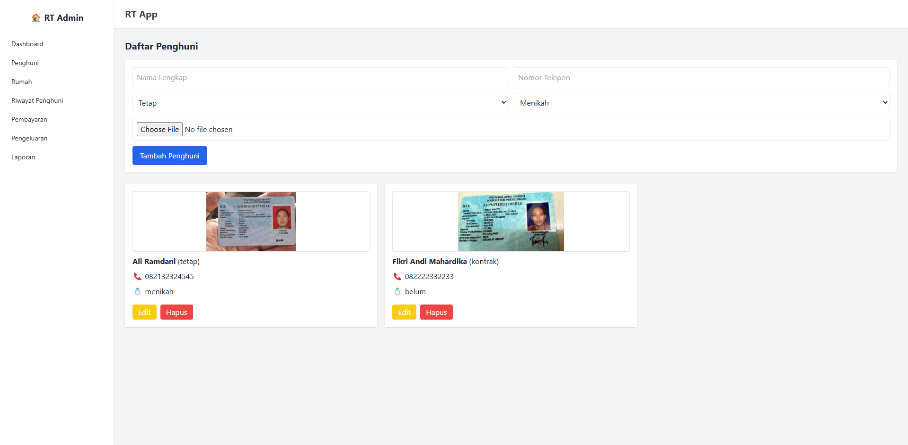
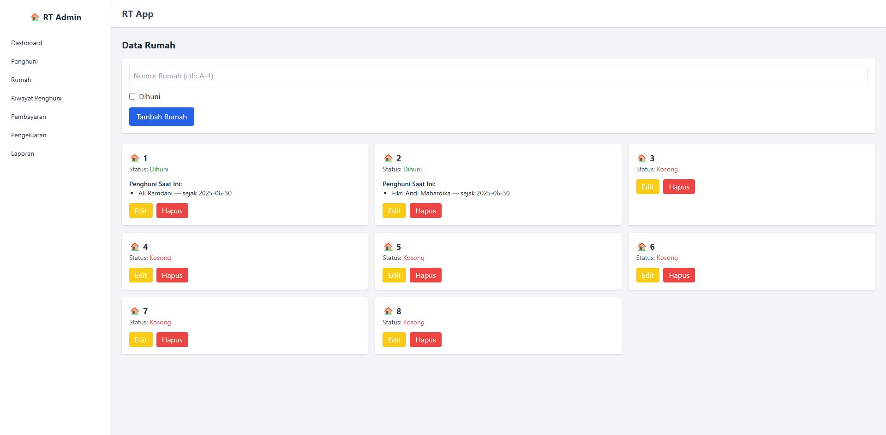
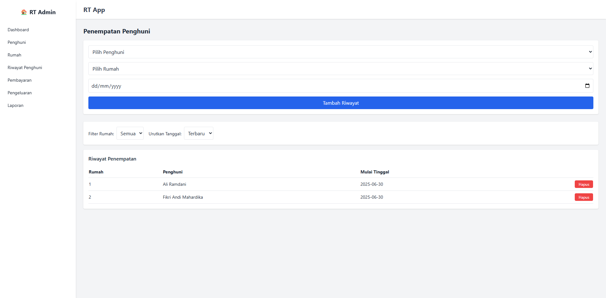
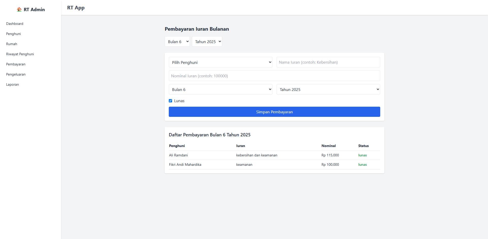
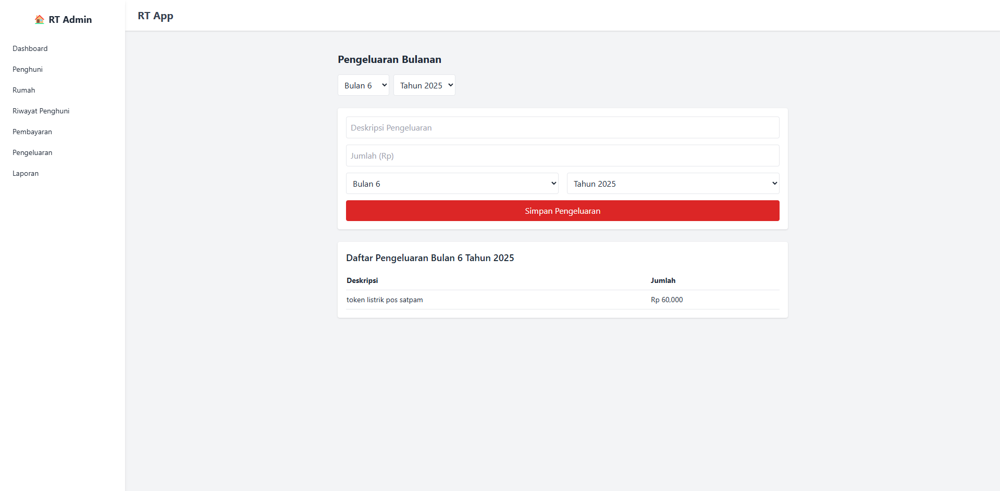
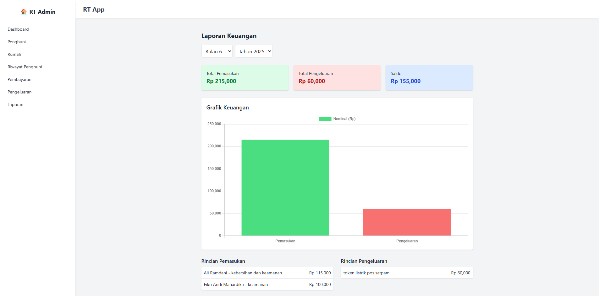
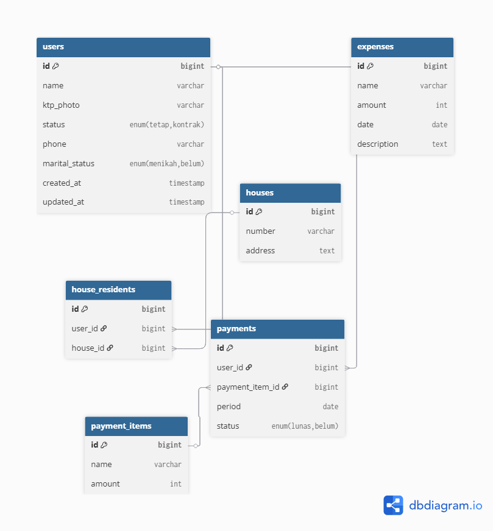

# 🏘️ Aplikasi Administrasi RT

Aplikasi Administrasi RT adalah aplikasi berbasis web untuk membantu Ketua RT dalam mengelola data penghuni, rumah, pembayaran iuran bulanan, dan pengeluaran RT. Proyek ini dibangun menggunakan **Laravel (backend)** dan **React.js dengan Tailwind CSS (frontend)** secara terpisah namun terintegrasi.

---

## 📦 Struktur Proyek

```
rt-app/
├── rt-app-backend/     # Backend Laravel
└── rt-app-frontend/    # Frontend React + Vite

````

---

## 🚀 Fitur Utama

- ✅ Manajemen rumah & penghuni
- 💰 Pencatatan iuran bulanan per penghuni (dengan status lunas/belum)
- 📤 Pencatatan pengeluaran RT
- 📊 Laporan keuangan dengan grafik pemasukan dan pengeluaran
- 🧮 Dashboard statistik otomatis
- 🔐 (Rencana) Multi-user dan akses peran (multi-role)

---

## 📥 Cara Instalasi (Untuk Developer)

### 1. Clone Repository
```bash
git clone https://github.com/aaronzanettsamudraweb/rt-app.git
cd rt-app
````

---

### 2. Jalankan Backend (Laravel)

```bash
cd rt-app-backend
composer install
cp .env.example .env
php artisan key:generate

# Konfigurasi .env (DB_NAME, DB_USER, DB_PASSWORD)
# Contoh:
# DB_CONNECTION=mysql
# DB_DATABASE=rt_app
# DB_USERNAME=root
# DB_PASSWORD=

php artisan migrate
php artisan storage:link

php artisan serve
```

---

### 3. Jalankan Frontend (React)

```bash
cd ../rt-app-frontend
npm install
npm run dev
```

Pastikan Server dan Database sudah aktif lalu akses aplikasi di: `http://localhost:5173`

---

## 📝 Akun & Penggunaan

* Tidak ada sistem login (sementara hanya untuk Pak RT)
* Semua data dapat diakses langsung dari tampilan frontend
* Admin dapat:

  * Menambahkan/mengedit rumah & penghuni
  * Menambahkan pembayaran dan pengeluaran
  * Melihat laporan & dashboard

---

## 🖼️ Screenshots
### Dashboard

### Penghuni

### Rumah

### Riwayat Penghuni

### Pembayaran

### Pengeluaran

### Laporan


---

## 📄 Entity Relationship Diagrams (ERD)


---

## 📊 Dokumentasi API (Ringkasan)

| Endpoint               | Deskripsi        |
| ---------------------- | ---------------- |
| `/api/users`           | Data penghuni    |
| `/api/houses`          | Data rumah       |
| `/api/payments`        | Pembayaran iuran |
| `/api/payment-items`   | Jenis iuran      |
| `/api/expenses`        | Pengeluaran      |
| `/api/reports/summary` | Rekap laporan    |

---

## 🔮 Rencana Pengembangan Selanjutnya

* 🔐 Sistem login multi-user
* 🧑‍💼 Role-based access (Admin, Bendahara, Ketua RT)
* 📅 Kalender kegiatan RT
* 📱 Akses mobile-friendly (PWA)
* 📂 Ekspor laporan ke PDF/Excel
* 💬 Notifikasi pembayaran jatuh tempo

---

## 👤 Developer

* Nama: **Aaron Zanett Samudra**
* GitHub: [@aaronzanettsamudraweb](https://github.com/aaronzanettsamudraweb)
